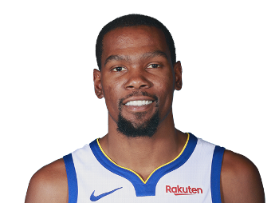
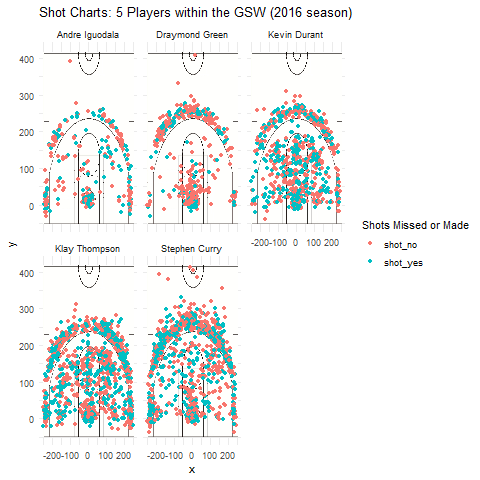
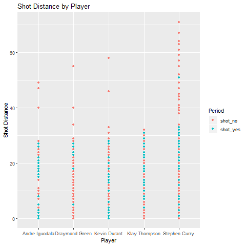

workout-01-Lara-Volski.Rmd
================
Lara Volski
March 11, 2019

Introduction
============

Are you a newbie to basketball, but you've just moved to the Bay Area, and you want to fit in? This article can help you relay some fast facts about the Bay Area's own Golden State Warriors to impress your friends. After reading this article, you'll be able to look like a long-time fan, since you'll have in-depth knowledge of how the top 5 Golden State Warriors faired in the 2016 season! You will be all set for sports trivia night.

The purpose of this project is to take an in-depth look at the shooting statistics of the top 5 GSW players (Stephen Curry, Kevin Durant, Draymond Green, Andre Iguodala, and Klay Thompson). The presented graphics account for their position on the court, the amount of times they made or missed a point, and percentage of shots they made out of all the total shots they attempted. This information can help us visualize the strengths and weaknesses of the players, and gain insight into their relative successes. It can also be used to determine if we can use statistics instead of value judgements to identify the 'best' player.

Motivation
==========

Sports like basketball carry incredible cultural value (Hartmann 2012). The amount of people who intensely follow sports is unmatched (Washington and Karen 2001). People of color are able to rise to prominence without as many structural inhibitions within the sporting world (Hartmann 2012). And there are strong parallels between sporting's emphasis on fairness and the United States' ideal of democracy (Hartmann 2012).

All of these factors contribute to the significance of sports, especially within cultural hubs like the Bay Area. This article is thus motivated by the desire to spread knowledge of sports like basketball to the general public. It will also allow readers to better understand what makes a "top" basketball player rise to the top. For people who are unfamiliar with the sport and have not watched any games, statistical visualizations can help foster an appreciation for a skilled player. In other words, we can use to data to recreate the sense of admiration a sports fan could get for a player by watching many games. It can also be used as an unbiased way to compare the relative skill of various players (or can it? Only a thorough analysis can tell...)

Background
==========

Kevin Durant
------------

 Kevin Durant was born in 1988 and played one season of college basketball for the University of Texas before he was drafted for the NBA. He played nine seasons in Oklahoma City before he signed with the Golden State Warriors in 2016. This article therefore represents his first season with the GSW. He is one of the highest paid basket players in the world, partly due to his endorsement deals with Foot Locker and Nike. You can find out more information [here](https://en.wikipedia.org/wiki/Kevin_Durant).

------------------------------------------------------------------------

Stephen Curry
-------------

 Stephen Curry was born in 1988 and has been named the NBA Most Valuable Player twice and won three NBA championships with the Warriors. Statistical analysts have called him the greatest shooter in [NBA history](https://bleacherreport.com/articles/2482473-is-stephen-curry-the-best-shooter-ever-yes-say-many-of-nbas-all-time-marksmen), so we'll see if the analysis generated by this report is in agreement. He is also said to have revolutionized the game of basketball by compelling teams to utilize the three-point shot in order to win (another thing that may be represented in the data visualizations to come!) He was drafted to the Golden State Warriors in 2009, and played basketball at Davidson before his draft. You can find out more information [here](https://en.wikipedia.org/wiki/Stephen_Curry).

------------------------------------------------------------------------

Klay Thompson
-------------

 Klay Thompson was born in 1990 and, like Stephen Curry, is also credited as one of the greatest [NBA shooters in history](https://www.news.com.au/sport/american-sports/nba-klay-thompsons-60-points-the-insane-stats-and-the-warriors-myth-his-epic-performance-busted/news-story/e8ca1c30cff33d036ffea64cd453c276). He is the son of a former NBA player, and played for the Washington State Cougars before he was drafted to the NBA in 2011. He and Stephen Curry have earned the nickname "Splash Brothers" because of their record number of three-pointers scored in their 2014 season. We'll see if the 2016 season can compare! Find out more [here](https://en.wikipedia.org/wiki/Klay_Thompson#cite_note-Kurtenbach-2).

------------------------------------------------------------------------

Andre Iguodala
--------------

 Andre Iguodala was born in 1984 and attended the University of Arizona before he was drafted to the NBA in 2004. He played for Philadelphia and the Denver Nuggets until he was acquired by Golden State in 2013. He was named the NBA Finals Most Valuable Player in 2015, when he won an NBA championship with the Golden State Warriors. Find out more [here](https://en.wikipedia.org/wiki/Andre_Iguodala).

------------------------------------------------------------------------

Draymond Green
--------------

 Draymond Green was born in 1990 and played college basketball for Michigan State for four years. He was drafted into the NBA in 2012 for the Golden State Warriors. He played a key role in the Warriors' 2015, 2017, and 2018 championship teams. 2016 is notably missing from this list - it will thus be interesting to see if he seems to have a poorer performance in the data visualiztions presented in this article. Find out more [here](https://en.wikipedia.org/wiki/Draymond_Green).

Data
====

Data tables were sourced from the Stats133 GitHub repository, an undergraduate-level statistics class taught at the University of California, Berkeley. This data was likely collected from Basketball-Reference, as the class has previously cited that as a source of its NBA-related datasets. The visualizations represented below relied on 5 datasets that were specific to the 5 analyzed players. These five datasets included information pertaining to whether a shot was made or missed, whether a successful shot was a 2 or 3 point field goal, the distance of the successful shot to the basket, and the x and y axis coordiantes from which a shot occured.

Analysis
========

**3 Effective Shooting Percentage Tables**

    ## -- Attaching packages -------------------------------------------------------------------------- tidyverse 1.2.1 --

    ## v ggplot2 3.1.0       v purrr   0.3.0  
    ## v tibble  2.0.1       v dplyr   0.8.0.1
    ## v tidyr   0.8.2       v stringr 1.3.1  
    ## v readr   1.3.1       v forcats 0.4.0

    ## -- Conflicts ----------------------------------------------------------------------------- tidyverse_conflicts() --
    ## x dplyr::filter() masks stats::filter()
    ## x dplyr::lag()    masks stats::lag()

**2PT Effective Shooting % by Player**

From the table depicted below, we can see that out of all of the 2 pt shots Andre Iguodala attempted, he made the highest percent of them. He's followed in a close second by Kevin Durant. However, it must be noted that Kevin Durant had the highest total amount of 2 pt shots attempted. Therefore, considering that he took 433 more 2 pt shots than Andre Iguodala, the amount of shots he made is very impressive!

| name           |  total|  made|  perc\_made|
|:---------------|------:|-----:|-----------:|
| Andre Iguodala |    210|   134|   0.6380952|
| Kevin Durant   |    643|   390|   0.6065319|
| Stephen Curry  |    563|   304|   0.5399645|
| Klay Thompson  |    640|   329|   0.5140625|
| Draymond Green |    346|   171|   0.4942197|

**3PT Effective Shooting % by Player**

From this table, we can already see that it is much more difficult to score 3 pt shots than 2 pt shots. The percentage of made shots for our 5 players have decreased! Andre Iguodala has even lost the 'less shots taken' advantage that he had in the previous table. Here we see that Klay Thompson and Stephen Curry have rightfully earned their "Splash Brothers" nickname - not only have they attempted the largest amount of 3pt shots, but they also have the highest percentage of successful 3 pt shots!

| name           |  total|  made|  perc\_made|
|:---------------|------:|-----:|-----------:|
| Klay Thompson  |    580|   246|   0.4241379|
| Stephen Curry  |    687|   280|   0.4075691|
| Kevin Durant   |    272|   105|   0.3860294|
| Andre Iguodala |    161|    58|   0.3602484|
| Draymond Green |    232|    74|   0.3189655|

**Effective Shooting % by Player**

Even though Kevin Durant was not the player with the top percentage in the previous two tables, his overall skill in making both 2 and 3 pt shots is demonstrated by the fact that he has the highest percentage of total shots. However, it must be noted that Klay Thompson and Stephen Curry have made a good deal more shots than Kevin. Andre Iguodala has attempted very few shots in comparison - his total percentage made is likely skewed.

| name           |  total|  made|  perc\_made|
|:---------------|------:|-----:|-----------:|
| Kevin Durant   |    915|   495|   0.5409836|
| Andre Iguodala |    371|   192|   0.5175202|
| Klay Thompson  |   1220|   575|   0.4713115|
| Stephen Curry  |   1250|   584|   0.4672000|
| Draymond Green |    578|   245|   0.4238754|

Shot Charts for the 5 players
-----------------------------

**Faceted Charts**

Here we see a visualization of all the attempted shots over the 2016 season by the top 5 players. Each dot represents their position on the court when they attempted the shot. Red dots represent a shot that has been missed, and blue dots represent a successful shot. As we can see in the graphs, Andre Iguodala truly did make much fewer attempts than players like Klay Thompson or Stephen Curry. Even a newbie basketball fan can gain a lot of respect for players that have made so many attempts, and still have so much "blue" represented in their graphs. 

Shot Distance for the 5 players
-------------------------------

**Shot Distance Graph**

This graph represents the shots made or missed by their distance from the basket. Not only does this graph allow us to visualize who made the most overall shots, but we can see who tends to shoot closer to the basket and who tends to attempt shots from far distances. It also allows us to see the relative success of players by their distance. Here we see Stephen Curry attempted the greatest amount of shots from far distances, but tended not to make those shots. In general, it seems that shots are more often successful when the player is closer to the basket.

Discussion
==========

So who is the best GSW player? That it totally up to how you want to interpret the data. If your idea of the best GSW player is someone who makes the greatest percentage of 3-point shots, Klay Thompson is your ideal player. If you think the best player should be whoever makes the greatest percentage of total shots, Kevin Durant is your ideal choice. If you think the best player is whoever attempts the most shots, then Stephen Curry is your ideal choice. Stephen Curry would also be your ideal best player if you want a player that can make shots from far away. This data also reveals how percentages can be skewed if certain players do not attempt as many shots as others. It is important to keep the total amount of shots a player has attempted in mind when using statistics to identify who you think the best player is.

Conclusion
==========

One of the most significant things about these top 5 GSW players is that they are all people of color. It is important to celebrate the accomplishments of minorities within the United States' current political atmosphere, and it is important to recognize their accomplishments using reproducible and universally understandable methods. Statistics can be an unbiased way to acknowledge the skill of sports and basketball players.

It can be difficult to draw value conclusions from statistics, however, because that does incorporate bias. Narrowing the players down to "best basketball player" in the GSW is difficult because it changes depending on one's definition of best. However, when it comes to overall successful shots, Kevin Durant takes the lead.

Take-home message
=================

While Andre Iguodala had the highest percentage of successful 2 pt shots, he also had the smallest amount of total shots. And while Klay Thompson had the highest percentage of successful 3 pt shots, the player with the most overall successful 2 and 3 pt shots was Kevin Durant. However, the most important thing to take from this data is that measurements of success can be biased by value judgements and small "sample" sizes (aka a small amount of total shots)

References
==========

Hartmann, D. 2012. Beyond the sporting boundary: the racial significance of sport through midnight basketball. *Ethnic and Racial Studies* 35(6): 1007 1022.

"Is Steph Curry The Best Shooter Ever? Yes, Say Many of NBA's All-Time Marksmen". Bleacherreport.com. June 1, 2015. Retrieved June 1, 2015.

Washington, R.E. and D. Karen. 2001. Sport and society. *Annual Review of Sociology* 27: 315-342.
